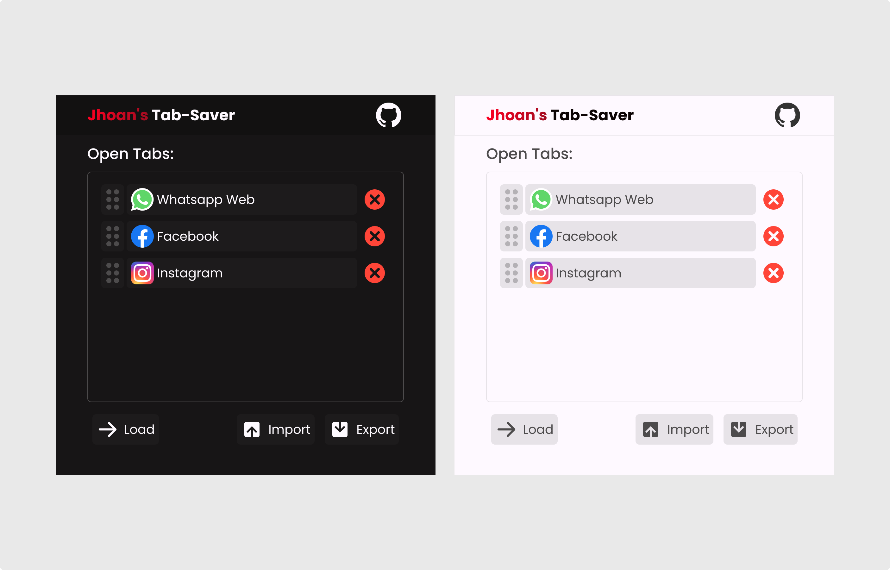

# Jhoan's Tab-Saver

## ¿Qué es Jhoan's Tab-Saver?
Jhoan's Tab-Saver es una extensión de navegador diseñada para ayudar a los usuarios a gestionar sus pestañas de manera eficiente. Permite modificar, cargar y exportar conjuntos de pestañas para facilitar la organización y la recuperación posterior.

## ¿Cómo funciona Jhoan's Tab-Saver?
Jhoan's Tab-Saver utiliza tecnología de navegador para interactuar con las pestañas abiertas y almacenar conjuntos de pestañas en formatos personalizables. Esto permite a los usuarios guardar sus sesiones de trabajo y restaurarlas según sea necesario.

## ¿Cómo instalar Jhoan's Tab-Saver?
Para instalar Jhoan's Tab-Saver, sigue estos pasos:
- Descarga la extensión desde el repositorio.
- Abre tu navegador y ve a la configuración de extensiones.
- Habilita el modo de desarrollador si es necesario.
- Arrastra y suelta el archivo descargado en la página de extensiones.

## ¿Cómo usar Jhoan's Tab-Saver?
Una vez instalada, puedes usar Jhoan's Tab-Saver de la siguiente manera:
- **Guardar pestañas:** Activa la extensión y haz clic en el botón "Guardar" para guardar el conjunto actual de pestañas.
- **Cargar pestañas:** Selecciona un conjunto guardado y haz clic en "Cargar" para restaurar esas pestañas.
- **Exportar:** Exporta conjuntos de pestañas en formatos como JSON para compartir o archivar.

## ¿Cómo puedes contribuir a Jhoan's Tab-Saver?
¡Estamos abiertos a contribuciones! Si deseas mejorar Jhoan's Tab-Saver, considera las siguientes áreas:
- Mejorar la interfaz de usuario para una mejor experiencia de usuario.
- Añadir funcionalidades nuevas como etiquetado de pestañas o sincronización entre dispositivos.
- Solucionar problemas reportados por la comunidad.

## ¿Dónde pueden recibir ayuda los usuarios con tu proyecto?
Si necesitas ayuda con Jhoan's Tab-Saver, por favor visita nuestra página de [Issues](https://github.com/tu-usuario/tu-repositorio/issues) para ver problemas conocidos o reportar uno nuevo. También puedes contactarnos directamente a través de [email del mantenimiento del proyecto].

## Quién mantiene y contribuye con el proyecto

Jhoan's Tab-Saver es mantenido por Jhoan y actualmente cuenta con contribuciones exclusivas del autor original. El proyecto está licenciado bajo la [Licencia Pública General GNU v3.0 (GPL-3.0)](https://www.gnu.org/licenses/gpl-3.0.html), lo que garantiza que el software y sus derivados permanezcan libres y abiertos para la comunidad. Si estás interesado en contribuir, por favor revisa nuestro [CONTRIBUTING.md](link al archivo CONTRIBUTING.md) para más detalles sobre cómo participar.

Para recibir soporte o reportar problemas, visita nuestra página de [Issues](https://github.com/tu-usuario/tu-repositorio/issues) en GitHub.

## Créditos de los Iconos

- Iconos de skill-icons de tandpfun a través de Iconify, diseñados por tandpfun.
  - Licencia: MIT
  - Enlace a la licencia: [MIT License](https://opensource.org/licenses/MIT)

---